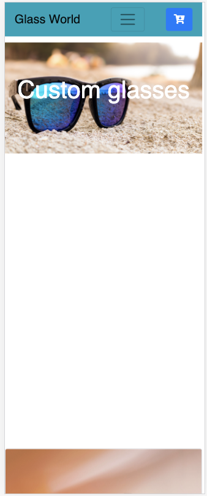
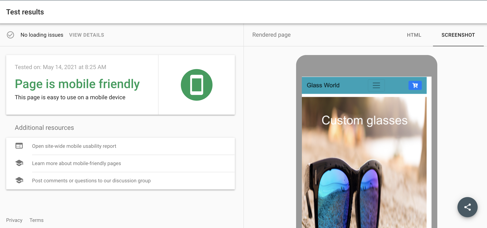
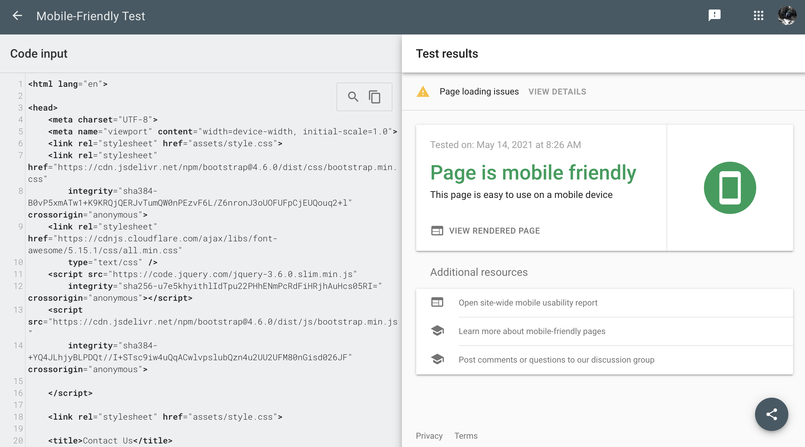
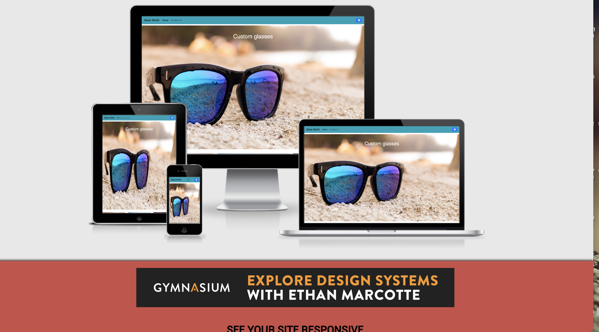
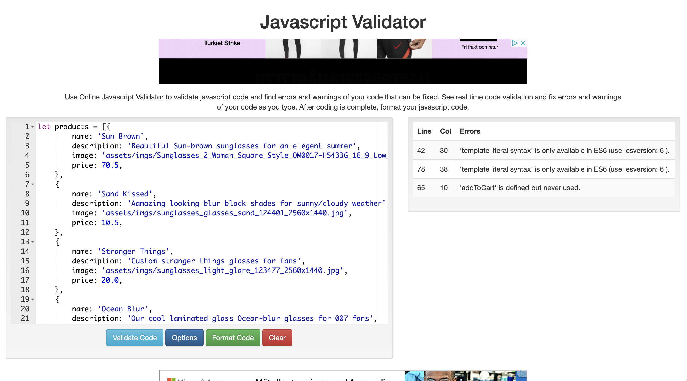
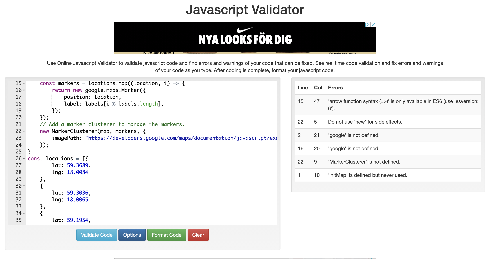
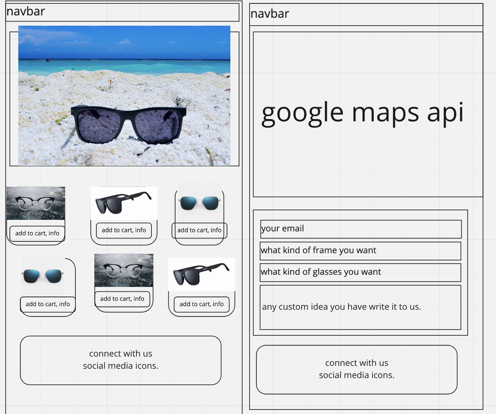

 
# Glass World MS2 project.
## project name and summry of concept
* With increasing in small Bussinesses in the world and people getting aware of that small Bussinesses can grow rapidly i made this an e-commerse site made for costumers who would prefer to select and make their costum made glasses.
## view live website [here.](https://ramish93.github.io/MS2/)
---
## Table of Content:
- [Overview](#overview)
- [Description](#description)
- [Ux](#ux)
- [User Stories](#user-stories)
- [Technologies Used](#technologies-used)
- [Testing](#testing)
- [Bugs and fixes](#Bugs-and-fixes)
- [Deployment](#deployment)
- [Credits](#credits)

## __Overview__:
I designed this website in two pages with same navigation, contact us section to show consistancy to user and so that they can move around and find text field for custum made glasses with contact us area easily.
As enormous increase in awareness now everybody wants to start an e-commerse website so they can work from home.
The goal of website is to have user look around to find what they like and if they dont are not satisfied with what they see they could also write us about their idea and see the loction of our store in stockhom and let us help them decide.
## __Description__:
* It is a inspiring e-commerse model website designed to give user control over design and material of the product they want and if they want to see the designs in person they can always come to the store given by google maps API on second page of website.
---
## UX
### __Strategy__
The idea behind this website is to attract indivisual of all ages to come and have full control over what they want to wear. there are alot of people who find themselves in predicaments where they like a product but only one part of the product doesn't fit their need so they
have to leave the product. for those people this e-commerse website will give them full control over the design and style of their own choosing.
#### Website Goals:
* The main goal of website is to promote shades in people of all ages and the strategy for it is to give them what they really want to wear.
* My target audiance is people from all ages but essencially youth because coming summer shades are not a need they are a necessity. To give them what they want not what other stores have to offer only.

#### User goals are:
* In world with covid its not ideal for people to go out in stores and purchase stuff so this e-commerse website is for everybody so they can get what they want from ease of their home and have full control over style of the product.
* Shades are a need for almost everybody and with this pandamic it is more of a necessity and this coming summer this Bussiness will give user a chance to decide and style their own shades to give them a feeling of exclusiveness.
* A small but intuative bussiness like this will give people a chance to control a product and design it however they like and they think will good on them. it not only increse the confidenace but give a feeling that this product is specificly made for them.
* Generally people want to feel good about themselves that they are contributing in making a product for themselves.

This website would be great in acheiving these goals mentioned above because:

* It would provide a platform for participants to put out their amazing ideas in the product which will in return allow the bussiness to grow by knowing what customer want and what is they feel most confortable in.
* Helping out 
* participants will be motivated to make thier own product and make design and style choices themselves which will in return give them a felling of exclusiveness.
* Along with advantage of promoting shades culture this website will promote custom made shades which is something not offered in current bussiness models.
* As mentioned earlier that the idea of custom made glasses will give customer a feeling of exclusiveness and full control over design which will in return increase confidenace in customer.

#### Developement and Bussiness goals:
* A website created to motivated people to promote shades culture.
* A website created with HTML5, CSS3, bootstrap framework, interactivity of Javascript, jQuery libery, API servises which is exciting and motivating to look at.
* I am as a developer happy and excited to make it a part of my work port-folio.
* In future seeing the popularity of this project i can think of turning it into an company that targets people from all around the world of all ages and make custom made product of all sorts not just glasses. This custom made design product culture will, i think, increase and excite the customers.

#### User Stories:
1. As a person looking to make a difference in myself and world i would want to see what is this site for which i would easily find and understand by hero image and clear information presented on front page.
2. I would like to have intuative navigation on webpage so i can surf the website easily so my website is easy to navigate with a nav-bar at top left and with clear discription of everything where it takes user.
3. As a new user i would like to have all the necessary information infront of me so i don't waste my time looking around for what i need so the website has all necessity information on front page and additional information on the second page.
4. When user see and like the webiste and it's purpose i would like them to book a product and if they are not satisfied and they go on second page they will fine an easy to fill form of idea and material of shades they want.
5. I would like to have options to send ideas of look into our store on second page reading about custom made shades and info about our store. 
6. I would like to either add a product to cart or give my idea to the company so they can start working on product or give me more intuative suggestions.
7. The goal of website is to make user participate in the work so With the intuative design and easy custom made form user would feel great after sending info and taking part in design of their own shades as per their needs.

### **Scope**:
This website incorporates an MVP (Minimal VIable Product) method which I considered a good idea for the following reasons:
* It brings the basic layout of the website and gives awareness to customer how the website is going to look like.
* It gives me an opportunity to see my design take a beautiful shape and improve it where necessary.
* Includes relevent and defining images and descriptions to make webpage look more exciting and fullfilling.
* Idea form for user will give them full control over style of their product per their need.
* Social media icons so that user can see and follow our work immediately and google maps API to see out store location if they are in stockholm.
### **Structure**:
I designed this website in two pages with same navigation, contact us section to show consistancy to user and so that they can move around and find custom made form and contact information easily.
Both pages have relevent functionality to help user navigate the website easily. and use of API and images enhance user experience. Both pages are have different theme and user will know the theme of specific page just by looking at the page in addition to that they have a contact us form with input fields so they can tell us what they want and what they want to be design of their product.
### **Skeleton**:
The website is divided into two pages first with information about the product and how we propose the product to look like. Second page with API integration so customer can find our store or write to us easily without too much hassle.
### **Surface**:
I wanted to make first-time user see what this website is about without reading content and i achived it by using relevent images to first single page to let user see the product and decide if they want to buy it. The use of colors was decided inorder with the color summer light color which was to remind user that this is a product they will need in near future.
#### Images:
* The images are selected very carefully with relevence to first page and indivisual section providing a feeling of confidenace and excitement to user.
#### Typography:
* I used Google Fonts to see different fonts I could use with my website and decided on "Alegreya, Roboto" and "Serif" as the back-up font. Alegreya and Roboto were my choice because of its often use and modern look.
### **Features**:
 __Navbar:__ 
 * Navbar is created in dark green color (#17a2b8) and nav-links with black to give a clear view to user. Navbar is not fixed to let user see the full height of website and not getting distracted by fixed stuck navbar.

 __Home Page:__ 
 * Home page has 4 hero images in bootstrap carasol that gives a full idea to user what this website is about and with full name of website which is quiet self-discriptive and my goal in carasol gives a full experience to user. 
 then i have second page for amazing customers. in this section i have integrated two API's for user to see the full extent of website.

 __contact us:__
 * In second page i use almost same layout to give consistancy to user and more make them clustered with all different design of new page. i used two section which are very seprate and give user a full awareness of the idea of website.
  
 ### __Features Left to Implement__:
 * I would love to add a payment method for user to add their details and add local or browser storage to save the choices customer made first time  but with the limited time and skills taught for MS2 project its only with functionality shown above.
 * I would love to expand the products not just glasses.
### Design Choices:
* __Font:__ The font family Roboto was chosen for this project because is has reliable readability and its very popular and 
 second font is Alegreya because it looks beautiful and modern and is popular.
 * __Images:__ Images choser for the landing page shows a beautiful beach with shades on sand to show that we need this product when we think of summer.
 * API's integrated are relevent to website as we have shops in stockholm and we can ship custom shades worldwide gives customer for flexibility.
 * __Color:__ Color for the website is green which is the color of summer, light and blue. To inspire user to book the product.
 * color used for links is same so that user can differentiate between text and links.
 * __Layout:__ The website in medium screen is centered i made this design choice because centered view for medium screen is appealing and modern. So i choose to have three columns side by side in each container.  Which , i think, gives it more aesthatic beauty.

### __Technologies Used__:
#### Languages:
- [HTML](https://en.wikipedia.org/wiki/HTML)
- [CSS](https://en.wikipedia.org/wiki/CSS)
- [Javascript](https://en.wikipedia.org/wiki/avascript)
- [jQuery](https://en.wikipedia.org/wiki/jQuery)
- [API](https://en.wikipedia.org/wiki/API)

#### Libraries used:
* Bootstrap 4.5 - A mobile-first responsive library used to construct various parts of the project, including the Navbar, Modal Forms, Media and Cards.
* GoogleFonts - Alegreya and Serif,Sans-Serif fonts
* FontAwesome - Used frequently for icons used throughout the website
* jQuery - for easy use of Javascript.
* Google maps API to show user our stores and find them easily.
* EmailJs.com API - to let user contact us 
#### Version Control:
- [Github](https://github.com/) - Used to store the code and use of Github Pages to deploy the website. 
- [Gitpod](https://gitpod.io/) - Used as the version control IDE for writing code and to further commit and push code to Gihub.
#### Other:
- [Code Institute Course Content](https://courses.codeinstitute.net/) - Source of learning code.
- [ChromeDevTools](https://developers.google.com/web/tools/chrome-devtools) - Used frequently to detect any issues/bugs or layout differences.
* [W3Schools](https://www.w3schools.com/) - used as a general resource.
* [StackOverFlow](https://stackoverflow.com/) - used as a general resource for tips or questions.
- [AmIResponsive](http://ami.responsivedesign.is/) - Used to check how the responsiveness of the website looks in different devices- available at the top of this [README](). 
---
### __Bugs and fixes:__
* My hero images were not responsive to i used following code to make them responsive.
* EmailJS webiste was alot changed compared to titorials in CI, i tried to contact tutor support but instead of guiding me to right direction the tutor said that i don't seem serious and he is not going to help me. whole convo should be saved. Anyhow i integrated it in website but took me soo much time.
* google maps API was giving some troubles because it want loading the coordinated i assigned in it as it turns out i had restricted the API key. problem was solved by reading the documentation of googlemaps API.
---
### __Unfixed bugs__:
* By adding <Doctype html> the hero image is disalligned. i looked up for solution on web but unfortunately non of them worked on my code.
 

 

---
### __Testing__:
* Both API's are tested multiple times and they work as they should.
* All the links in across all three pages take the user to desired location and they open in another tab.
* The website is tested in __Android__: Samsung Note 3, Note 4, Galexy S8,S9 Moto 4G, Pixel 2 and 2XL, and __Apple__: Iphone 4,5,6,7,8 and X as well as Ipad and Ipad pro.

* To ensure that the website is responsive across all pages i used. [Google Mobile Friendly Test](https://search.google.com/test/mobile-friendly?utm_source=gws&utm_medium=onebox&utm_campaign=suit). And the result is fully responsive.
* Landing page,
 

* contact us page:
 

 * For responsiveness across all devices the website [AmIResponsive](http://ami.responsivedesign.is/) is used. And result is.
  

* For Html validation W3 Validator was used, click link to see result. [W3 Html validator](https://validator.w3.org/nu/?doc=https%3A%2F%2F8000-dd61392f-e80b-4db4-a829-cf89f148345b.ws-eu03.gitpod.io%2Findex.html).
* Css validator was used to validate css, click link to see result. [W3 Css validator](https://jigsaw.w3.org/css-validator/validator)
* and for Javascript, Javascript validator is used [W3 javaScript validator](https://beautifytools.com/javascript-validator.php)
  
  
  

### Wireframes:
- Landing Page:
 

___
## Deployment
* First a GIthub account was created, I created new repository by clicking the green button saying "new".In this project I used the Code Institute's student templet.
* Click on the green "gitpod" button which is directed to to [Gitpod](https://gitpod.io/)
* Gitpod is a cloud based version control software which is used to write all of the code for this project.
* It was added commited and pushed in the terminal to Github where it is stored in a repository.
* Under "Settings", I scrolled down to Github Pages and selected "Master Branch", to where the page was automated.
* When it was selected, the project was pushed to Github pages and the URL is then displayed and on clicking it it brings to the weblink.
* The code can be run locally by selecting "clone" which provides an URL you can use on your local computer or "download" option where one can download the zip file on your computer.

To work on this project with local IDE like VScode etc:
* Follow this link to [Glass World!](https://ramish93.github.io/MS2/).
* Under the Repo name choose "Clone or Download".
* Copy URL in HTTP section.
* In your Editor open the terminal and choose the folder you want to save this project in.
* Type git clone and paste that HTTP URL.
* Press enter and a clone of this repo will be created in your machine and you can work on it now.
---

## Credits

### Content
* code for the some parts is copied form bootstrap, google maps API tutorials and emailJS code snippets. Most of the code is 
written by me.
### Media
* The photos in this website were downloaded from Pexels and google.

### Acknowledgements

* The idea of this project was inspired because of growth in small local bussiness and people wanting to make custom products for themselves in order to 
feel exclusiveness adn full in control of what they are wearing.
* My Mentor and friend, **Mubeen**, for his guidance, help and advising me to understand what kind of design is better for user.
* Tutor Support was terrible specially mister **stephen** who choose to ignore a student who needed help. but not all the tutors i had good experience with other tutors aswell.